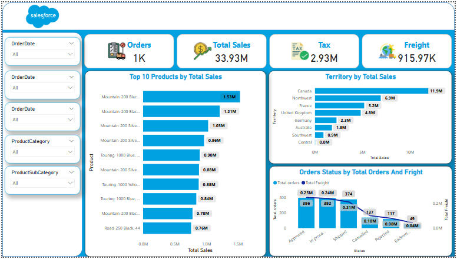
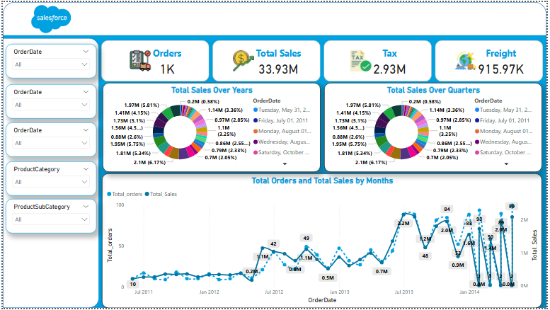

# 🚀 Salesforce Sales Performance Dashboard (Power BI)

An interactive Power BI dashboard analyzing **Salesforce’s sales performance, regional trends, and product insights**.  
This report provides a detailed view of total sales, order status, tax, and freight — helping businesses understand sales distribution and performance efficiency.

---

## 📊 Project Overview

The dashboard visualizes **Salesforce’s key sales metrics** to uncover insights across different regions, products, and time periods.  
It contains **three pages**, each focusing on a specific analysis area:

1. **Overview Page** – Displays key metrics (Total Sales, Orders, Tax, Freight) and Top 10 Products.  
2. **Sales Trend Analysis** – Shows total sales and orders across years, quarters, and months.  
3. **Detailed View Page** – A drill-through page that provides individual order details for deeper analysis.  

---

## 🎯 Objectives

- Monitor overall sales and financial performance.  
- Compare sales across regions and product categories.  
- Identify top-selling products and territories.  
- Analyze yearly, quarterly, and monthly sales trends.  
- Enable quick drill-down to detailed sales records.  

---

## 🧩 Key Metrics

| Metric | Description |
|--------|--------------|
| **Total Orders** | 1K total orders processed |
| **Total Sales** | 33.93M overall sales revenue |
| **Tax** | 2.93M total tax collected |
| **Freight** | 915.97K total freight cost |
| **Top Product Sales** | Mountain 200 Black, Touring 1000 Silver, Road 250 Black |
| **Top Territory** | Canada (11.9M sales) |

---

## 🖼️ Dashboard Preview

| Cover | Overview | Sales Trend Analysis | Detailed View |
|-----------|-----------|----------------------|----------------|
|  |  |  |  |

Each page focuses on actionable insights — from **KPIs and trends** to **in-depth sales details**.

---

## 🛠️ Tools Used
- **Power BI** (Data Visualization & Dashboard Design)  
- **Excel** (Data Cleaning & Preparation)  
- **DAX Functions** (Time Intelligence, KPIs)  

---

## 📁 Dataset
Due to file size limitations, the dataset is hosted on Google Drive:  
[🔗 Download Dataset](https://docs.google.com/spreadsheets/d/1WPHFyMiGeY2HGySM4k4IfMzQQEG2CuzA/edit?usp=sharing&ouid=110943316790500764779&rtpof=true&sd=true)

---

## 👩‍💻 Author
**Rania Elwan**  

_Data Analyst | Power BI | SQL | Excel_

